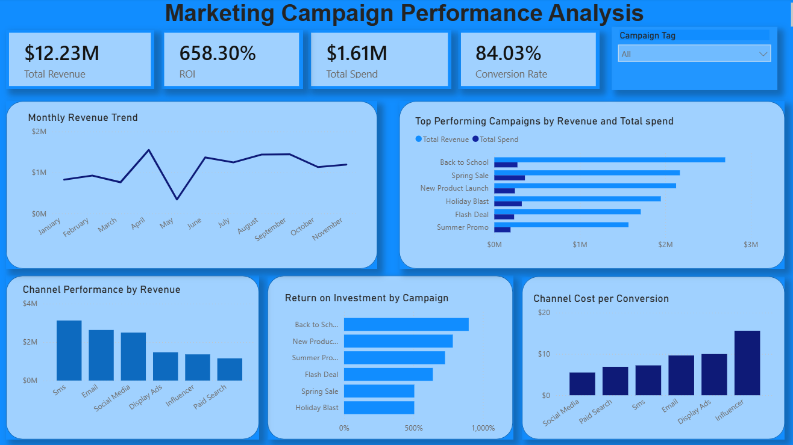

#  Marketing Campaign Performance Analysis

##  Business Objective
Determine which marketing campaigns and channels generated the highest return on investment (ROI) and customer conversions to support smarter marketing budget allocation.

---

##  Dashboard Preview

---

## 🛠️ Tools Used
- **Microsoft Excel** — data exploration
- **Power Query** — data cleaning and transformation
- **Power BI** — dashboard design and visualization
- **DAX** — calculated metrics and KPI development

---

##  Data Cleaning Process
- ✅ Assigned correct data types to all columns
- ✅ Removed duplicate rows
- ✅ Left blank numerical values (Clicks, Spend, Revenue) as null
- ✅ Replaced blank text values with N/A
- ✅ Removed rows with invalid dates (start date later than end date)
- ✅ Added Campaign Duration Days column to calculate the length of each campaign

---

##  Calculated Metrics

| Metric | Description | Formula |
|--------|-------------|---------|
| **ROI** | Revenue generated relative to spend | (Revenue - Spend) / Spend × 100 |
| **Conversion Rate** | People who saw a campaign and converted | Conversions / Impressions × 100 |
| **Cost Per Conversion** | Amount spent per conversion achieved | Spend / Conversions |

---

## ❓ Analytical Questions
1. How did monthly revenue trend throughout 2025?
2. Which campaign generated the highest revenue relative to marketing spend?
3. Which marketing channel generated the most revenue?
4. Which campaigns produced the highest ROI?
5. Which marketing channel acquired customers at the lowest cost?

---

## 💡 Key Insights

###  Revenue Trend
Revenue started at approximately **$800K** in January and grew steadily to a peak of **$1.5M** in April. A significant drop occurred in May, falling back to around **$300K**, the lowest point of the year. Revenue then recovered strongly from June onwards, stabilising between **$1.2M and $1.4M** through September and October before declining slightly in November.

###  Campaign Performance
**Back to School** generated the highest revenue at approximately **$2.8M** while requiring relatively low marketing spend, making it the most efficient campaign overall. Spring Sale and New Product Launch followed closely behind. Summer Promo generated the least revenue, suggesting it underperformed compared with the others.

###  Channel Performance
**SMS** was the strongest channel generating approximately **$3M** in revenue, followed by Email and Social Media. Display Ads, Influencer and Paid Search all generated significantly less revenue. This suggests SMS and Email should remain priority channels for future campaigns.

### Return on Investment
**Back to School** delivered the highest ROI followed by New Product Launch and Summer Promo. **Holiday Blast** had the lowest ROI among all campaigns, meaning it returned the least relative to what was spent, making it the weakest campaign overall.

###  Customer Acquisition Efficiency
**Social Media** had the lowest cost per conversion at approximately **$5**, making it the most cost-effective customer acquisition channel. Influencer had the highest cost per conversion at approximately **$15**, three times more expensive than Social Media. Social Media provided the best value when the objective was acquiring customers efficiently.

---

##  Recommendations

### 1. Invest More in the Back-to-School Campaign
Back to School consistently delivered the highest revenue and best ROI. Future budgets should prioritise this campaign as it clearly resonates with the audience and drives the most purchases.

### 2. Make SMS and Email the Priority Channels
SMS and Email generated the most revenue across all channels. These should remain the backbone of future campaign strategies any budget cuts should avoid these channels.

### 3. Shift Influencer Budget to Social Media
Influencer marketing costs **$15** per customer acquired while Social Media costs only **$5**. Reallocating a portion of the Influencer budget to Social Media would acquire more customers at a lower cost.

### 4. Reduce Spend on Paid Search
Paid Search generated the least revenue of all channels. The budget allocated to it could be better spent on SMS, Email or Social Media which have all proven to drive stronger results.

---

## 📁 Files in This Repository
| File | Description |
|------|-------------|
| `messy_marketing_campaign_dataset.xlsx` | Raw dataset |
| `Marketing_Campaign_Dashboard.pbix` | Power BI dashboard file |
| `README.md` | Project documentation |

